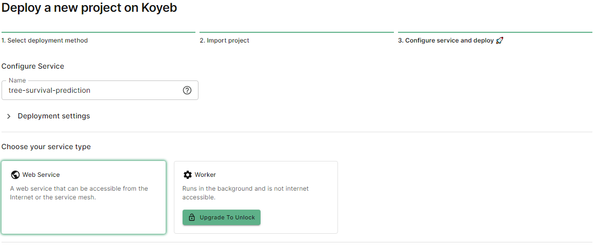

# Practica de despliegue de modelos de Machine Learning

## Introducción
En este repositorio se encuentra el código necesario para desplegar un modelo de Machine Learning. Se busca detallar el paso a paso para poder realizar el despliegue y conocer el flujo de MLOps.

Se analizan las técnicas empleadas con el fin de implementar y automatizar la integración continua (CI), la entrega continua (CD) y el entrenamiento continuo (CT) para sistemas de aprendizaje automático (AA).

Diseñar y entrenar un modelo de AA es solo una pequeña parte del desafío, lo verdaderamente complejo es su implementación, que comprende la configuración, automatización, recopilación y verificación de datos, pruebas y depuración, la administración de recursos, el análisis de modelos, la administración de metadatos y procesos, la infraestructura de entregas y la supervisión. Es por ello que comienza a aplicarse las prácticas de MLOps.

MLOps es una práctica de la ingeniería de AA, cuyo fin es unificar el desarrollo (Dev) y las operaciones (Ops) del sistema de AA. La práctica de MLOps implica abogar por la automatización y la supervisión en todos los pasos de la construcción del sistema de AA, incluida la integración, las pruebas, el lanzamiento, la implementación y la administración de la infraestructura.

## Arquitectura del proyecto


- Se codificará en Python y se usará la biblioteca scikit-learn para la generación de modelos
- Se utilizará GitHub como gestor de versiones del código y DVC como gestor de versiones del dataset y de los modelos
- Como servicio de alojamiento del modelo y dataset se utilizará Google drive
- Se utilizará GitHub Action para el proceso de integración continua y despliegue continuo (CI / CD)
- Por último, se utilizará FastAPI para la creación del API REST y Docker para el despliegue del servicio

Por medio de Github Action, se van a activar tres workflows diferentes:

- Testing: se va a encargar de ejecutar los test unitarios

- CI / CD: se va a encargar de la creación del Docker y desplegar el servicio cada vez que hay una actualización del modelo.

- Reentrenamiento: va a utilizar Scikit-learn para reentrenar un modelo de Machine Learning y generar nuevos modelos actualizados.

## Distribución de archivos

- **.dvc/ :** configuraciones de DVC
- **.github/workflows/ :** archivos que ejecutaran las acciones en GitHub Action
- **api/ :** API para la realización de una predicción
- **datset/ :** dataset traqueado
- **img :** imágenes para el readme
- **model/ :** modelo generado
- **notebooks/ :** notebooks donde se analizó el dataset y la generación del modelo
- **src/ :** archivos usados para el CI-CD

## Notebook
Se busca crear un modelo que pueda predecir el porcentaje de no supervivencia de un árbol dependiendo de diferentes factores

Se encuentran dos archivos:
-  [Data-análisis](notebook\data-analisis.ipynb): donde se analizaron las variables disponibles del dataset y se determinó cuáles son las verdaderamente relevantes para el modelo.

-  [Modelo](notebook\model.ipynb): donde se analizaron diferentes métodos de entrenamiento y se realizó una búsqueda de hiperparametros para determinar cuál sería el más conveniente. Además, se generó un primer modelo para realizar el primer despliegue.

## Implementación de DVC

DVC se utiliza como gestor de versiones del dataset y de los modelos. Estos archivos suelen ser muy pesados, por lo que git no suele manejarlos adecuadamente. 

DVC permite subir estos archivos pesados a un servicio de alojamiento (storage), para este caso Google Drive, y genera un archivo de trackeo, el cual es el que se sube a GitHub. 

El archivo de trackeo posee la ubicación del archivo original y, además, lleva el control de versiones del mismo.


<sup>Para este caso, tenemos el archivo model.pkl el cual se sube a un storage. el mismo es trackeado mediante el archivo model.pkl.dvc y es este archivo el que se sube al git</sup>

Para la utilización del paquete además del:

    pip install dvc

hay que instalar las dependencias adicionales según el storage a utilizar, para este caso:

    pip install dvc[gdrive]

Para usarla lo mejor es hacer un service accounts de Google. Siguiendo el tutorial de la documentación de DVC se puede realizar sin problema:

[DVC user guide - Google Drive - Service accounts](https://dvc.org/doc/user-guide/data-management/remote-storage/google-drive#using-service-accounts)

<sub>*Nota: si bien puede usarse Google Drive sin la necesidad de realizar un service accounts, no es recomendable ya que, al momento de hacer el CI/CD, no se tendrá acceso al dataset o al modelo*</sub>

Por ultimo para implementar el DVC, seguir la documentación de DVC:

[DVC user guide - Google Drive](https://dvc.org/doc/user-guide/data-management/remote-storage/google-drive)

Es importante agregar al .gitignore los archivos que se van a trackear (dataset, modelo, etc.) para evitar que se suban al git y solo se suban los archivos de trackeo

## Implementación de pipeline para CI-CD

Se generaron 3 archivos dentro de la carpeta src, que son los encargados, al utilizar GitHub Action, del proceso de integración continua y despliegue continuo (CI / CD):

- prepare.py: el encargado de preparar el dataset. Toma el dataset crudo, excluye las columnas que no son necesarias, elimina cualquier fila que le falte algún dato y genera un nuevo archivo: data_Modif.csv. Este es el que se utilizara para la generación del modelo
- train.py:  el encargado de general el modelo a partir del data_Modif.csv
- utils.py: métodos auxiliares, como ser, la configuración del logging, el guardado del nuevo modelo y la generación de un reporte

Para poder realizar la implementación de los pipelines se generó el archivo dvc.yaml, el mismo contiene los pasos de ejecución:

- El primer paso es el prepare:
    ```
    prepare:
    cmd: python src/prepare.py
    outs:
    - dataset/data_Modif.csv
    ```
Estamos diciendo que ejecute el archivo prepare.py y que la salida será el data_Modif.csv

- Como segundo paso es el training:
    ```
    training:
    cmd: python src/train.py
    deps:
    - dataset/data_Modif.csv
    ```
Estamos diciendo que ejecute el archivo train.py y que como dependencia use el data_Modif.csv

El dvc.yaml se ejecuta con el comando:

    dvc repro -f

y generará, debido a los pasos indicados, un modelo actualizado, el mismo no se actualizará en el repositorio, sino que posteriormente es necesario realizar:

    dvc add model/model.pkl
    dvc push

Esto se hará cuando se realice la configuración del GitHub Action

## Implementación de api

Se genera un api que permite realizar una predicción al modelo generado. La misma es implementada con FastAPI.

En el archivo main.py se genere la app con las solicitudes, para este caso solo se maneja una solicitud POST que recibe los valores y devuelve la predicción.

El archivo model.py es donde se crea las clases para manejar y validar los valores de entrada y salida. Se realiza con pydantic, esta librería es el que se encarga de la validación de los datos y la creación del objeto, las clases son heredadas de la clase BaseModel. 
```
class PredictionRequest(BaseModel):
    Species: str 
    Light_ISF: float
    Soil : str 
    Sterile : str 
    Conspecific : str 
    AMF : float
    EMF : float
    Phenolics : float
    Lignin : float
    NSC : float
```
En cada clase se especifica el nombre de las claves (las que tiene que usar el modelo) y el tipo de dato que tiene que manejar, pydantic se encarga de realizar estas validaciones.

Adicionalmente, para las clases categóricas, se definió una validación personalizada para comprobar que los valores ingresados sean los correctos:

```
@validator('Species')
    def categoria_especies(cls, especie):

        especiesAdmitidas = ['Acer saccharum', 'Quercus alba', 'Quercus rubra', 'Prunus serotina']

        if not (especie in especiesAdmitidas):
            raise ValueError('Especie no admitida. Las especies admitidas son: ' + str(especiesAdmitidas))
        
        return especie
```

El archivo estimador.py es el encargado de cargar el modelo, transformar los datos (la lógica de ambos métodos se encuentra en utils.py) y realizar la predicción.

La prueba en local se realiza mediante uvicorn:

    api.main:app

El comando es [ubicación]:[nombreDeLaApp], la ubicación se colocar reemplazando las " \ " por "." y el nombre de la app es la que se haya definido en el main.py ("**app** = FastAPI(docs_url='/')")

Acá es donde se puede colocar valores para realizar una prueba en local:


## Test de api

Una mejor forma de testear la api es mediante el TestClient de FastAPI y pytest. Es necesario la instalación de los paquetes httpx y pytest. Se crean los archivos __init__.py y test_main.py dentro de la carpeta de la api.

En el test_main.py se carga la app:

```
from .main import app
client = TestClient(app)
```

y se define las funciones de prueba:

```
def test_prediccion_positiva():
    response = client.post('/v1/predic',
                           json={
                               "Species": "Acer saccharum",
                                "Light_ISF": 0.106,
                                "Soil": "Prunus serotina",
                                "Sterile": "Non-Sterile",
                                "Conspecific": "Heterospecific",
                                "AMF": 22.0,
                                "EMF": 0.0,
                                "Phenolics": -0.56,
                                "Lignin": 13.86,
                                "NSC": 12.15
                            })
    
    assert response.status_code == 200
    assert response.json()['Event'] == 1.0
```
En este caso le digo que voy a probar la solicitud POST en '/v1/predic' con el json definido. Y en las dos últimas líneas defino la respuesta que espero, para este caso un código de respuesta del servidor de 200 (ok) y el valor de la predicción de 1.

Se definió dos métodos de prueba, uno que espera una respuesta de 1 y otro que espera una respuesta de 0.

Al ejecutar el archivo:

```
pytest api\test_main.py
```
Se ejecuta el test y, si ocurre lo esperado, se obtiene lo siguiente:


## Workflow para el testeo de la api

GitHub Actions permite Automatizar y ejecutar flujos de trabajo directamente desde el repositorio de GitHub. Se debe crear un archivo YAML para definir la configuración de flujo de trabajo, este archivo debe ser guardado en la ubicación .GitHub/workflows del repositorio para que pueda ser ejecutado.

YAML es un lenguaje de serialización de datos y suele utilizarse en el diseño de archivos de configuración. Es un lenguaje de programación popular porque está diseñado para que sea fácil de leer y entender, ya que, utilizan la sangría al estilo Python (aunque no admite tabulación) para determinar la estructura e indicar la incorporación de un elemento de código dentro de otro.

El Workflow para el testeo (configurado en el testing.yaml) será el encargado de realizar una descarga del último modelo y ejecutar el test definido en api/test_main.py:

---
```yaml
name: Testeo de API
```
Es el nombre del workflow y es el que aparecerá en la pestaña "Actions" del repositorio 

---

```yaml
on: 
  push:
    branches:
      - workflow_testing_api
      - main
```
Con `on` defino que eventos hacen que se ejecute el workflow. Para este caso, el evento que lo desata es el realizar un `push` en la rama (`branches`) con nombre `workflow_testing_api` o en la rama `main`

---

```yaml
jobs:
  testing-api:
```
Con `jobs` le pongo nombre a un grupo de acciones con un solo objetivo, es decir, defino los 'trabajos'. Para este caso se definió un solo trabajo denominado testing-api

---

```yaml
    runs-on: ubuntu-latest
    env:
      GDRIVE_CREDENTIALS_DATA: ${{ secrets.GDRIVE_KEY }}
```
Con `runs-on` en que entorno se va a desplegar el workflow, acá se definió que en Ubuntu. Mientras que con `env` defino las variables de entorno (las que se pueden utilizar en cualquier parte del workflow). 

GDRIVE_CREDENTIALS_DATA es la variable que contiene la key que utiliza DVC para acceder al model y al dataset (tiene que ser es nombre sino no la encuentra DVC). La key, para que no quede su información publica por motivos de seguridad, debe cargarse mediante Repository secrets de GitHub, los mismos se crean en `settings -> secrets and variables -> Action` 


y en Repository secrets, al crear un nuevo secrets vuelco el contenido de la key


Para usar el secret durante el workflow, simplemente coloco: `${{ secrets.YOUR_SECRET_NAME }}`

---

```yaml
    steps:
```
Con `steps` defino las acciones y el orden a realizarlas. Podría definir todo el workflow en un solo paso, pero separarlo todo en varios pasos más pequeños facilita el conocer en qué estado se encuentra el workflow al momento de la ejecución y, en caso de un error, en donde se ocasiono.

---

```yaml
      - name: Acceso al repositorio
        uses: Action/checkout@v3
```
Los pasos se definen con `name` y con `uses` indico que realice lo indicado en Action/checkout (repositorio de tercero en GitHub). 

Es decir, con `uses` puedo utilizar lo que hayan hechos otros usuarios, workflow probados y optimizados, para GitHub Action. De esta forma me ahorro la configuración de elementos complejos. 

El Action/checkout@3 verifica el repositorio y lo descarga al ejecutor, lo que permite utilizarlo durante la ejecución. El @3 indica la versión.

---

Con `run` defino las acciones, en su orden, a realizar (como si los realizara desde el cmd). A continuación, el resto del yaml, el cual está dividido en 3 pasos más:
```yaml
      - name: Creando y activando un entorno virtual
        run: |
          pip3 install virtualenv
          virtualenv venv
          source venv/bin/activate
        
      - name: Instalando dependencias
        run: |
          pip install dvc[gdrive]
          pip install -r api/requirements-app-test.txt
          pip install --upgrade pyopenssl

      - name: Traer el modelo y testeando la API
        run: |
          dvc pull model/model.pkl -r myremote
          pytest api/test_main.py
```

Como se indicó anteriormente, al realizar un `push` en la rama, comienza a ejecutarse el workflow. Yendo a la pestaña Action puede verse el estado:


Acá se puede ver, a la izquierda, "Testing API" que es el `name` que se había colocado y 3 corridas, dos que fracasaron (por error en el yaml) y una que fue satisfactoria. Las corridas se muestran con el commit con que fueron realizadas

## Workflow para el entrenamiento continuo

Es el encargado de actualizar el modelo cada cierto tiempo; toma el dataset actualizado, realiza un nuevo entrenamiento, guarda el nuevo modelo para que se encuentre disponible para ser utilizado y genera un reporte con el nuevo score del modelo y lo adjunta al commit donde se actualizo. 

La estructura es la misma que el workflow para el testeo de API, con un par de particularidades:

```yaml
on:
  push:
    branches:
      - workflow_entrenamiento_continuo
  #schedule:
  #  - cron: '0 */6 * * *'
  workflow_dispatch:
      input:
        reason:
          description: Motivo de la corrida
          default: Actualizar modelo
```
`schedule` se utiliza para que la corrida sea programada, en este caso se indica que se debe ejecutar cada 6 horas (se encuentra como comentario ya que es un modelo de ejemplo), es posible indicar, por ejemplo, que se ejecute cada cierta cantidad de días o que sea todos los martes a las 09Hs, entre otras configuraciones

`workflow_dispatch` permite la ejecución manual y, para este caso, se definió que al momento de ejecutarlo se indique el motivo de la corrida. El botón para ejecutar la corrida aparecerá en la pestaña 'action' y seleccionando el workflow correspondiente:


El botón solo aparece cuando el archivo de configuración YAML se encuentre en la rama main

---
```yaml
    - name: Actualizar a Node16
        uses: Action/setup-node@v1
        with:
          node-version: '16'
```
El node es necesario actualizar ya que de lo contrario daría error más adelante en el workflow (en el `uses: iterative/setup-cml@v1`). Su actualización o no hay que evaluarlo dependiendo de lo que se vaya a utilizar en el workflow. 

---
```yaml
    - name: Actualizando Train model
        run: |
           dvc repro -f 
           echo "Entrenamiento completo"

```
Ejecuto `dvc repro -f` que, como ya se mostró, ejecuta lo indicado en el archivo dvc.yaml que, para este caso, utiliza lo implementado en la carpeta src. Ver: [Implementación de pipeline para CI-CD](#implementación-de-pipeline-para-ci-cd-)

---
```yaml
      - uses: iterative/setup-cml@v1
      - name: Agregado comentario con el reporte
        run: |
          cat report.txt >> report.md 
          cml comment create --target=commit/$(git log  --pretty=format:'%h' -1) report.md
```
`iterative/setup-cml@v1` es lo que permite agregar un comentario al commit (en este caso el reporte generado del modelo creado).

`cat report.txt >> report.md` transforma el txt en un archivo de markdown

`cml comment create --target=commit/$(git log  --pretty=format:'%h' -1) report.md` creo el comentario. 

Por default el comentario se creará en el commit que desencadeno el workflow, que en este caso no es el mismo en el que se actualizo el modelo (eso se realiza en un commit posterior, generado por el mismo workflow).

Por ello es necesario indicar `--target=commit/$(git log  --pretty=format:'%h' -1)`, con el `git log ...` obtengo el hash del ultimo commit generado y con el `--target=commit/` le indico que el comentario lo realice en ese commit

El commit donde se actualiza el modelo con el comentario indicando el reporte del mismo se ve de la siguiente manera:


## Workflow para el despliegue e integración continuos

Es el encargado de tomar el nuevo modelo y desplegar el servicio. Para ello creará una Docker image y la subirá a Koyeb para la generación de una app, en donde, se podrá realizar predicciones del modelo. Para ello hay que realizar unos pasos previos:

* Crear un Dockerfile

Docker empaqueta el software en unidades estandarizadas llamadas contenedores que incluyen todo lo necesario para que el software se ejecute: bibliotecas, herramientas de sistema, código, tiempo de ejecución, etc. 

Docker se instala en cada servidor y proporciona comandos sencillos que puede utilizar para crear, iniciar o detener contenedores. Esto permite estandarizar el despliegue de la app, ya que Docker se encargará de la configuración del servidor para el despliegue del contenedor.

Para la creación de un contenedor es necesario utilizar un Dockerfile, para nuestro caso:

```Dockerfile
FROM python:3.11.3
WORKDIR /app
```
Primero le indico que utilice python y, luego, que nuestro directorio de trabajo será `/app` 

---
```Dockerfile
COPY api/ ./api
COPY model/model.pkl ./model/model.pkl
COPY initializer.sh .
```
Copiamos las carpetas y archivos que vamos a necesitar, el comando en `COPY [origen] [destino]`, el `.` estoy indicando que es en la raíz del contenedor.

---
```Dockerfile
RUN pip install -U pip && pip install -r ./api/requirements.txt
```
Instalamos los paquetes necesarios en el contenedor.

---
```Dockerfile
RUN chmod +x initializer.sh
```
Para ejecutar líneas de comandos lo debo realizar mediante un archivo `.sh`. Para que esto pueda realizarse necesito realizar, con `RUN chmod`, una asignación de permisos de acceso: `+x` indica que se le agregue (indicado mediante el `+`) a todos los usuarios permisos de ejecución (indicado mediante el `x`) del archivo `initializer.sh`. 

También se puede escribir `a+x`, donde `a` indica que es a todos, pero al ser este el valor por defecto puede omitirse e indicar solamente `+x`

---
```Dockerfile
EXPOSE 8000

ENTRYPOINT ["./initializer.sh"]
```
Habilito el puerto 8000 para comunicación e indico que el ejecutable que utilizara el contenedor es `./initializer.sh`, que será el que despliegue la app.

* Crear un initializer.sh

Es el ejecutable que utilizara el contenedor Docker para el despliegue de la app, lo realiza mediante Gunicorn:

```
#!/bin/bash 

gunicorn --bind 0.0.0.0 api.main:app -w 2 -k uvicorn.workers.UvicornWorker 
```

`#!/bin/bash`: se agrega como primera línea para asegurar la compatibilidad.

`-–bind 0.0.0.0` = definimos la ip

`-w` = Es el número de workers. Un worker gestiona una solicitud y la responde al cliente

`-k` = define el tipo de workers

* Crear una cuenta en DockerHub

Se necesita una cuenta de DockerHub, ya que la Docker image se carga ahí y desde ese lugar se sube a Koyeb. 

Con la cuenta creada, se crea en GitHub los secrets: DOCKERHUB_USERNAME, username de la cuenta generada, y DOCKERHUB_TOKEN, el token de acceso que se genera en `settings -> security -> New 
Access Tokens`. 

Por último, se crea un repositorio, se genera la imagen y se sube.

* Crear una cuenta en Koyeb

Se necesita una cuenta de Koyeb para subir el contenedor Docker y desplegar el servicio. La razón por la cual se eligió Koyeb es debido a que posee una parte gratuita que permite realizar pequeñas pruebas. Koyeb posee la opción de implementar el servicio mediante GitHub, simplificando el despliegue de la app, la cual no se utilizó para familiarizarse con el uso de Docker.

Con la cuenta creada, se crea en GitHub el secrets KOYEB_TOKEN con el token de acceso, que se genera en: `account settings -> Personal access tokens`. Por último, se crea la app donde se desplegará el servicio, vamos a 'Create Web Service' y seguimos los pasos:

1. Seleccionamos el método de deploy, en este caso por Docker:


2. Indicamos la dirección de la Docker Image, ubicada en DockerHub, con su tag:


El tag, palabras clave para categorizar contenido, se define al subir la Docker image


3. Indicamos el nombre del servicio y el tipo:

La región donde se despliega

Y el nombre de la app


Con esto queda el servicio desplegado, en la información del mismo, se tiene la URL publica


Que, al dirigirnos a esta, vemos la interface de FastAPI para realizar consultas


* Workflow en GitHub Actions

Con el servicio desplegado generamos el Workflow en GitHub Actions para la actualización continua del mismo. La estructura es la misma que los dos workflow anteriores, por lo que solo comentare las correspondientes a la tarea específica de este workflow:

```yaml
on: 
  workflow_run:
    workflows: ["Continuous Training"]
    branches: [main]
    types:
      - completed
```
`workflow_run` permite ejecutar el workflow en función de otro que se esté ejecutando. Para este caso, este workflows se ejecutará cuando el `workflows ["Continuous Training"]`, que se está ejecutando en la rama `[main]` se encuentre completado(`completed`).

Recordemos que el 'Continuous Training' es el encargado de reentrenar el modelo con el nuevo dataset y generar una actualización del mismo. Cuando ese workflow concluya comenzara a correr este que los desplegara en el servicio de Koyeb

---
```yaml     
      - name: Docker login
        uses: Docker/login-action@v3
        with:
          username: ${{ secrets.DOCKERHUB_USERNAME }}
          password: ${{ secrets.DOCKERHUB_TOKEN }}

      - name: Creamos la imagen y realizamos push al DockerHub
        uses: Docker/build-push-action@v5
        with:
          context: .
          push: true
          tags: ignaciomilesi/practica-despliegue-modelos-ml:latest
```
Nos logeamos en DockerHub, creamos y pusheamos la imagen. En 'tag' es necesario indicar la dirección del contenedor con su tag correspondiente, posee la forma `usuario/nombreContenedor:tag` 

---
```yaml
      - name: Cargamos y configuramos el CLI de Koyeb
        uses: koyeb-community/install-koyeb-cli@v2
        with:
          api_token: "${{ secrets.KOYEB_TOKEN }}"
          github_token: "${{ secrets.GITHUB_TOKEN }}"
      
      - name: Redeploy en el servidor Koyeb
        run: Koyeb service redeploy prac-desp-model-ml/tree-survival-prediction   
```

Cargamos y configuramos el CLI de Koyeb e indicamos que realice el redeploy del servicio (ira al contenedor del DockerHub y desplegara la nueva imagen). Se debe indicar el nombre de la app y el servicio (con la forma `nombreApp/nombreService`) definidos al momento de la creación del web service.

Al finalizar la corrida del workflow, se verá en Koyeb la actualización del servicio (toma unos minutos)


